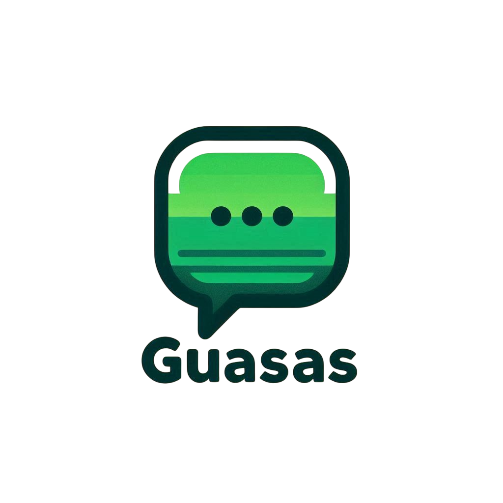

# Manual de Instalación y Arranque de la Aplicación

Recomendamos que en el caso de que se quiera probar la aplicación se utilice el **APK** de la release para facilitar el proceso

Video demo : https://www.youtube.com/watch?v=xByIQkSKqb0

## 1. Requisitos Previos

Tener instalado Flutter (versión estable recomendada).

Tener instalado Dart SDK (normalmente viene con Flutter).

Tener instalado Android Studio (o VSCode con los plugins de Flutter/Dart).

Tener un emulador Android o un dispositivo físico conectado para probar.

Gradle: Herramienta de automatización de compilación utilizada por Flutter para Android.

CocoaPods: Gestor de dependencias para proyectos iOS en Flutter.

Java versión 17 (Para evitar problemas)

## 2. Clonar el proyecto

`git clone https://github.com/rafduqcol/Guasas.git`

`cd guasas`

## 3. Instalar las dependencias
Dentro de la carpeta del proyecto:

``flutter pub get``

Esto descargará todos los paquetes necesarios listados en el pubspec.yaml.

## 4. Ejecutar la aplicación
Compila y corre tu app en modo debug:

`flutter run`

Asegúrate de tener un emulador o un dispositivo físico conectado.

## 5. Notas adicionales
Si ves errores como "Missing plugin implementations", corre:

`flutter clean`

`flutter pub get`
